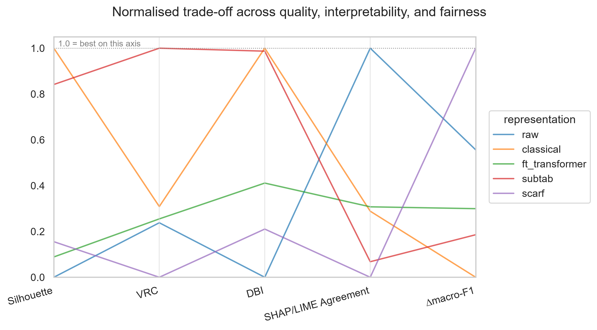

# smart-tabular-embeddings
Creating Smart Embeddings for Complex Multi-Type Tabular Datasets

## Table of Contents

- [Results](#results)
- [Environment Setup](#environment-setup)
- [Data Sources & Licensing](#data-sources--licensing)
- [Pipeline Overview](#pipeline-overview)
- [Dataset Shapes](#dataset-shapes)
- [Features](#features)
- [Notebook Run Order](#notebook-run-order)
- [Shared Code](#shared-code)
- [Development Notes](#development-notes)
- [License](#license)

## Results

`06_evaluation_protocol.ipynb` compares five representations of the same
TMDB rows -- `raw`, `classical`, `ft_transformer`, `subtab`, `scarf` -- on
three axes: clustering quality (silhouette / Calinski-Harabasz /
Davies-Bouldin), interpretability (SHAP/LIME attribution agreement), and
fairness (how much a classifier can recover `original_language` from the
representation, `delta_macro_f1` -- lower is fairer). No single
representation wins on all three:

| Representation | Silhouette | Calinski-Harabasz | Davies-Bouldin | Interpretability agreement | Fairness (lower leakage) |
|---|---:|---:|---:|---:|---:|
| raw | 0.00 | 0.24 | 0.00 | **1.00** | 0.56 |
| classical | **1.00** | 0.31 | **1.00** | 0.29 | 0.00 |
| ft_transformer | 0.09 | 0.25 | 0.41 | 0.31 | 0.30 |
| subtab | 0.84 | **1.00** | 0.99 | 0.07 | 0.19 |
| scarf | 0.16 | 0.00 | 0.21 | 0.00 | **1.00** |

Each column is min-max normalised to `[0, 1]` with `1.0` always the more
favourable value (see `src/evaluation/tradeoff.py`); raw metric values are
in `evaluation/raw_tradeoff_metrics.csv`. Reading across: `subtab` gives
the best-separated clusters, `raw` keeps the most consistent SHAP/LIME
attributions, and `scarf` leaks the least about `original_language`. One
caveat that matters when reading this table: the host regressor used for
the interpretability probe was fit on the same target `ft_transformer` was
trained to predict, so `ft_transformer`'s numbers there have a structural
head start that shouldn't be read as a general interpretability ranking
(see `src/evaluation/host_model.py`).



`06_extended_evaluation_protocol.ipynb` reruns this same protocol over all
eight representations, adding text-free retrains of each embedding
paradigm; its CSVs and figures live under the `06_extend_`-prefixed paths
described in [Notebook Run Order](#notebook-run-order).

## Environment Setup

This project uses a conda environment (Python 3.11).

```bash
conda env create -f environment.yml
conda activate smart-tabular-embeddings
```

To use this environment as a Jupyter kernel in VS Code / Jupyter, run once
from within the activated environment:

```bash
python -m ipykernel install --user --name smart-tabular-embeddings --display-name "Python (smart-tabular-embeddings)"
```

then select "Python (smart-tabular-embeddings)" as the kernel for notebooks
in `notebooks/`.

## Data Sources & Licensing

This pipeline works with a single dataset:

- **Full TMDB Movies Dataset 2024 (1M Movies)** — sourced via Kaggle.
  Licensed under the [Open Data Commons Attribution License (ODC-By) v1.0](https://opendatacommons.org/licenses/by/1-0/index.html).

Raw data files are not included in this repository. See `src/eda/loaders.py`
for how to obtain the dataset locally.

## Pipeline Overview

A TMDB-only data pipeline, in seven notebooks plus one extended variant:
characterizing the raw dataset, cleaning it, constructing and comparing
candidate feature sets, producing two final train/val/test splits,
encoding those splits into the shared per-type feature representations
and baselines, training and comparing three embedding paradigms
(FT-Transformer, SubTab, SCARF) -- each also retrained text-free -- on
top of those encoders, and finally evaluating all of those
representations against each other on clustering quality,
interpretability, and fairness. See [Notebook Run Order](#notebook-run-order)
below for how the notebooks depend on each other, and
[Dataset Shapes](#dataset-shapes) for what each stage produces.

## Dataset Shapes

| Stage | Rows | Columns |
|---|---:|---:|
| Raw (Kaggle download) | 1,456,829 | 24 |
| Cleaned (`01_overview_cleaning`) | 863,858 | 19 |
| Chosen candidate A -- `tmdb_br_gt0` | 10,504 | 25 |
| Chosen candidate B -- `tmdb_nbr_gt5` | 107,219 | 23 |

Two candidates come out of `02_preprocessing` and carry through
`03_feature_split`, differing in how they trade off row count against the
`budget`/`revenue` features:

- **`tmdb_br_gt0`** (`tmdb_budget_revenue_gt0`): rows with non-null
  `budget` **and** `revenue`, filtered to `vote_count > 0`. Keeps `budget`
  and `revenue` as features (25 columns), at the cost of a much smaller row
  count. Split 80/10/10 -> train 8,403 / val 1,050 / test 1,051.
- **`tmdb_nbr_gt5`** (`tmdb_no_budget_revenue_gt5`): `budget` and `revenue`
  dropped entirely as columns (too sparse to keep -- see `02_preprocessing`
  Section 1), filtered to `vote_count > 5`. 23 columns, roughly 10x the
  rows of the other candidate. Split 70/15/15 -> train 75,053 / val 16,083
  / test 16,083.

Both splits are stratified on `original_language`. All six resulting
train/val/test files are saved to `data/final/`.

## Features

**Raw dataset** (24 columns): `id`, `title`, `vote_average`, `vote_count`,
`status`, `release_date`, `revenue`, `runtime`, `adult`, `backdrop_path`,
`budget`, `homepage`, `imdb_id`, `original_language`, `original_title`,
`overview`, `popularity`, `poster_path`, `tagline`, `genres`,
`production_companies`, `production_countries`, `spoken_languages`,
`keywords`.

**`tmdb_br_gt0`** (25 columns): `id`, `title`, `vote_average`, `revenue`,
`runtime`, `budget`, `original_language`, `original_title`, `overview`,
`popularity`, `genres`, `production_companies`, `production_countries`,
`spoken_languages`, `keywords`, `has_genres`, `has_keywords`,
`has_production_companies`, `has_production_countries`,
`has_spoken_languages`, `has_overview`, `release_year`,
`release_month_sin`, `release_month_cos`, `title_differs_from_original`.

**`tmdb_nbr_gt5`** (23 columns): same as `tmdb_br_gt0` above, minus
`revenue` and `budget`.

## Notebook Run Order

Each notebook (except `00`) reads a file the previous one writes, so they
must be run in order:

1. **`00_tmdb_eda.ipynb`** -- characterizes the raw dataset (missingness,
   cardinality, text/token-length, language detection). Produces no saved
   file; its findings inform the cleaning decisions made in `01`.
2. **`01_overview_cleaning.ipynb`** -- cleans the raw data (recodes,
   dedup, drops, caps and drops) ->
   `data/processed/tmdb_clean.parquet`.
3. **`02_preprocessing.ipynb`** -- builds and compares 7 candidate
   variants, refines and selects the two carried forward ->
   `data/processed/tmdb_br_gt0.parquet`, `data/processed/tmdb_nbr_gt5.parquet`.
4. **`03_feature_split.ipynb`** -- stratified train/val/test split, rare-
   language and vocabulary bucketing -> the six files in `data/final/`.
5. **`04_feature_encoding.ipynb`** -- fits the shared per-type encoders
   (numeric standardisation + piecewise-linear binning, categorical
   lookup, list-field pooling, frozen SBERT text encoding) on whichever
   candidate is active in `src/config.py`, and builds the raw/classical
   baselines -> encoders under `data/encoders/<candidate>/`, baseline
   parquet files under `models/<candidate>/`.
6. **`05_embedding_paradigms.ipynb`** -- trains and compares three
   embedding paradigms (FT-Transformer, SubTab, SCARF) on top of `04`'s
   fitted encoders, plus a text-free retrain of each (`include_text=False`,
   trained from scratch rather than masked at inference, since the
   text-included tokenizer/encoder is structurally shaped around text
   being present) -> each paradigm's `{train,val,test}.parquet` embeddings
   (`id` first column) and `diagnostics/loss_curve.csv` under
   `models/<candidate>/<paradigm>/` (and `<paradigm>_no_text/` for the
   text-free retrains), with training-curve/diagnostic figures under
   `reports/figures/05/`.
7. **`06_evaluation_protocol.ipynb`** -- compares the five text-included
   representations (`raw`, `classical`, `ft_transformer`, `subtab`,
   `scarf`) on clustering quality (silhouette/Calinski-Harabasz/
   Davies-Bouldin), t-SNE, interpretability (SHAP/LIME agreement), and
   recoverability/fairness of `original_language`, then assembles a
   normalised trade-off table across all three axes -> clustering/
   trade-off CSVs under `evaluation/`, figures under
   `reports/figures/06/`. **`06_extended_evaluation_protocol.ipynb`**
   mirrors this same protocol over all eight representations, including
   the three text-free variants -> its own `06_extend_`-prefixed CSVs
   under `evaluation/` and figures under `reports/figures/06_extend/`.

Notebooks `00`-`03` log a timestamped summary to `reports/eda_log.md`;
`04` logs to its own `reports/feature_encoding_log.md`; `06` and
`06_extended` both log to `reports/evaluation_protocol_log.md`.

## Shared Code

Every notebook's Setup cell imports from shared modules rather than
duplicating logic:

- **`src/eda/`** -- `loaders.py` (dataset loading) and `helper.py` (EDA/
  cleaning helper functions), used by notebooks `00`-`03`.
- **`src/report.py`** -- figure saving and the timestamped markdown-log
  helper, used by every notebook (each passes its own log file).
- **`src/config.py`** -- constants shared across every notebook and
  module (paths, the active candidate, the random seed, split names).
- **`src/helper.py`** -- JSON save/load for fitted encoders, plus the
  id-first-column convention for saved representation parquet files;
  used by `04_feature_encoding.ipynb` and `src/features/pipeline.py`.
- **`src/features/`** -- the per-type encoder classes and the
  `FittedEncoders` bundle that `04_feature_encoding.ipynb` fits and saves,
  for reuse by later embedding-paradigm notebooks.
- **`src/paradigms/`** -- FT-Transformer/SubTab/SCARF's model, training,
  and config code, plus a shared `TrainingLogger` for consistent
  training-curve diagnostics; trained and compared by
  `05_embedding_paradigms.ipynb`. `seeds.py`'s `set_global_seed()` seeds
  `random`/`numpy`/`torch` once at that notebook's start.
- **`src/evaluation/`** -- `eval_setup.py` (shared representation/label
  loading and row-alignment checks), `clustering_metrics.py`,
  `tsne_viz.py`, `host_model.py`, `interpretability.py` (SHAP/LIME
  agreement), `fairness.py` (recoverability probes), and `tradeoff.py`
  (assembling and normalising the trade-off table); used by
  `06_evaluation_protocol.ipynb` and `06_extended_evaluation_protocol.ipynb`.

## Development Notes

### Notebook outputs and `nbstripout`

This repo has [`nbstripout`](https://github.com/kynan/nbstripout) installed
as a git filter (`nbstripout --install`), which strips notebook cell
outputs from `.ipynb` files at commit time. This means:

- Rendered outputs stay in your local working copy — nothing is deleted on
  disk, and re-running a notebook restores them.
- `git diff` / commits only show code and markdown changes, not embedded
  image/output blobs, so notebook diffs stay readable.
- If a GitHub view of a notebook looks like it's missing output cells,
  that's the default — unless that notebook was deliberately committed
  with the filter disabled (see below), which is the case for the
  `00`/`03`/`04`/`06`/`06_extended` notebooks as of this pipeline's final
  polish, so they render with output on GitHub.

If you want a specific notebook's outputs to actually go into a commit
(e.g. so it renders with output on GitHub), you have two options:

- Temporarily disable the filter for that commit: `git commit --no-verify`
  won't help here since this is a content filter, not a hook — instead run
  `nbstripout --uninstall` first, commit, then optionally re-run
  `nbstripout --install` afterwards to resume stripping.
- Or force-add the notebook bypassing the filter: `git add --renormalize`
  won't restore stripped output either, since stripping happens on the
  `git add`/commit path itself — uninstalling before committing is the
  reliable option.

If `git add` still produces a stripped blob even after `nbstripout
--uninstall` (confirm with `git config --get filter.nbstripout.clean`,
which should return nothing), fall back to writing the blob directly and
pointing the index at it, bypassing whatever is intercepting `git add`:

```bash
hash=$(git hash-object --path notebooks/<name>.ipynb -w --stdin < notebooks/<name>.ipynb)
git update-index --cacheinfo 100644 "$hash" notebooks/<name>.ipynb
```

## License

[MIT](LICENSE) © Sana-Shikalgar. Note this covers the code only — the
TMDB dataset itself is licensed separately under ODC-By v1.0, see
[Data Sources & Licensing](#data-sources--licensing).
